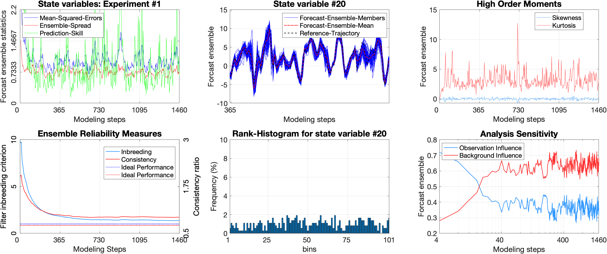
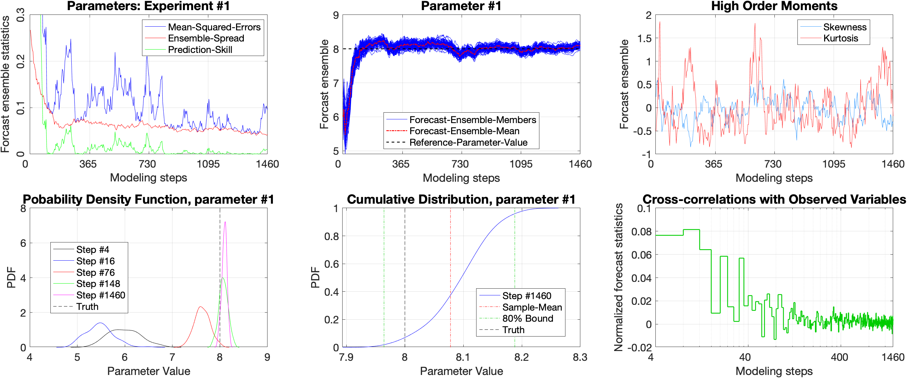

# SPEL

This directory contains Matlab routines used for experiments in papers:

Ait-El-Fquih, Boujemaa, Mohamad El Gharamti, and Ibrahim Hoteit. "A Bayesian Consistent Dual Ensemble Kalman Filter for State-Parameter Estimation in Subsurface Hydrology." Hydrology and Earth System Sciences, 20, no. 8 (2016): 3289-3307.

Gharamti, M. E., Boujemaa Ait-El-Fquih, and Ibrahim Hoteit. "An iterative ensemble Kalman filter with one-step-ahead smoothing for state-parameters estimation of contaminant transport models." Journal of Hydrology 527 (2015): 442-457.

Gharamti, M. E., A. Kadoura, J. Valstar, S. Sun, and Ibrahim Hoteit. "Constraining a compositional flow model with flow‐chemical data using an ensemble‐based Kalman filter." Water Resources Research 50, no. 3 (2014): 2444-2467.

Contact: gharamti@ucar.edu

SPEL: State and Parameters Estimation Library
---------------------------------------------

The following library is designed, for academic purposes, to perform state-parameters estimation using different ensemble techniques. Four different ensembles schemes are available: The Joint EnKF, the Dual EnKF, the Joint OSA EnKF and the Dual OSA EnKF. The library uses two simple models for testing and these are: the Lorenz 63 and 96.   

The main script is called `SPEL.m` and is based on user defined inputs for various parameters. An example is readily available, within SPEL, if you skip the input step; i.e., press enter for all asked questions. 

Further explanations of the inputs, the outputs and the usage of the library can be obtained by typing: help `SPEL.m`

